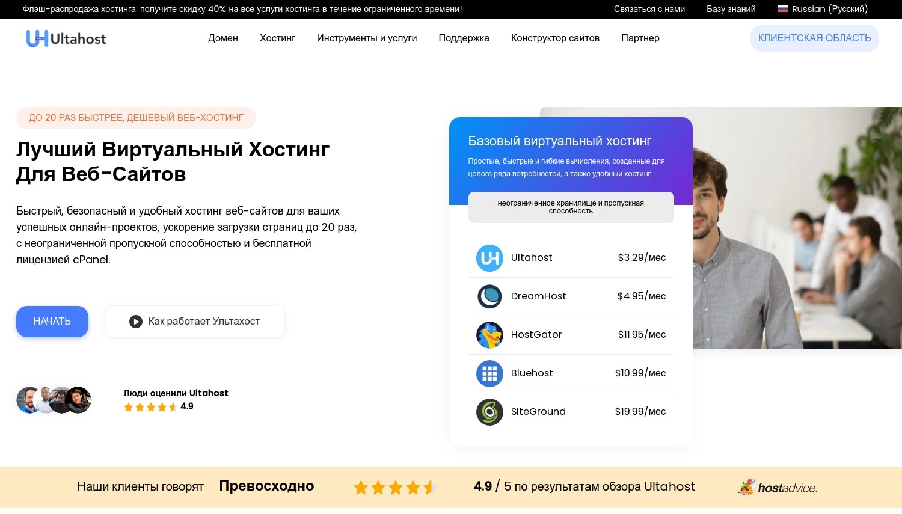
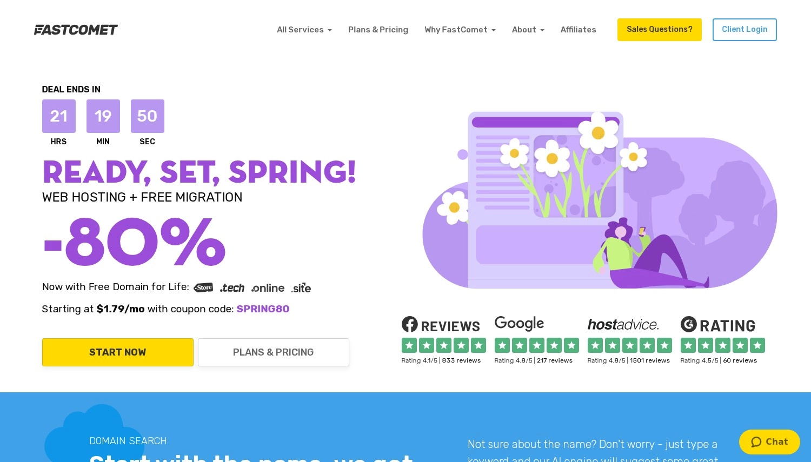
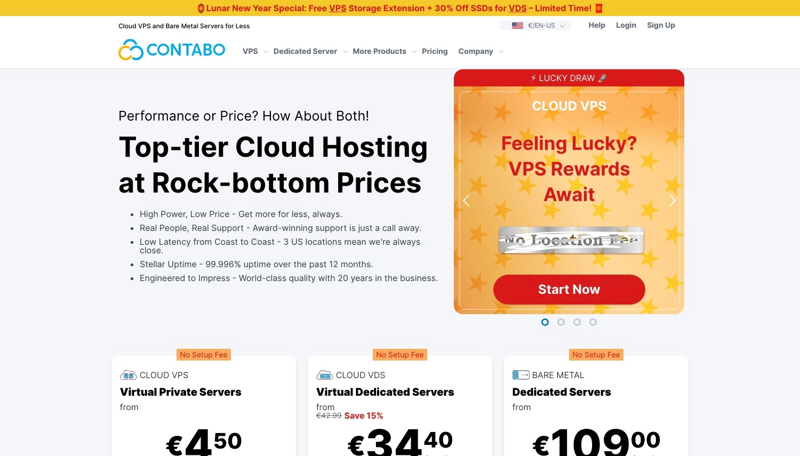
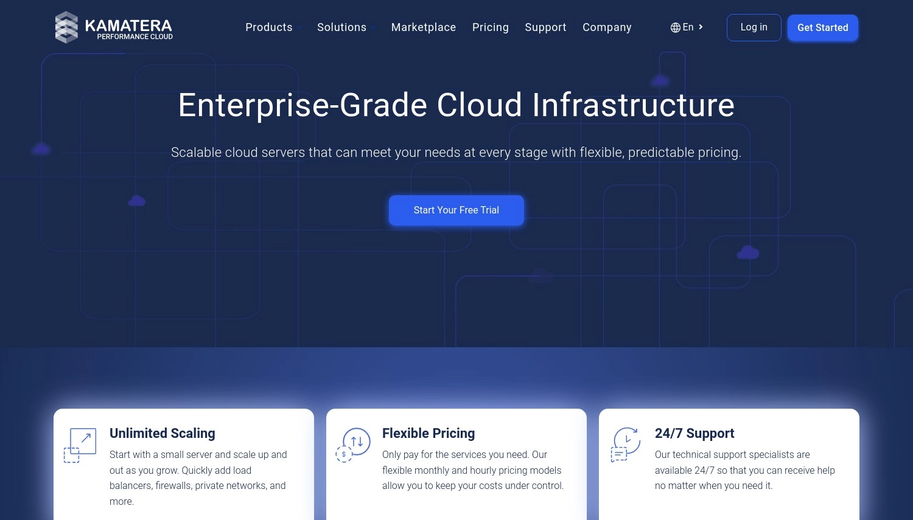
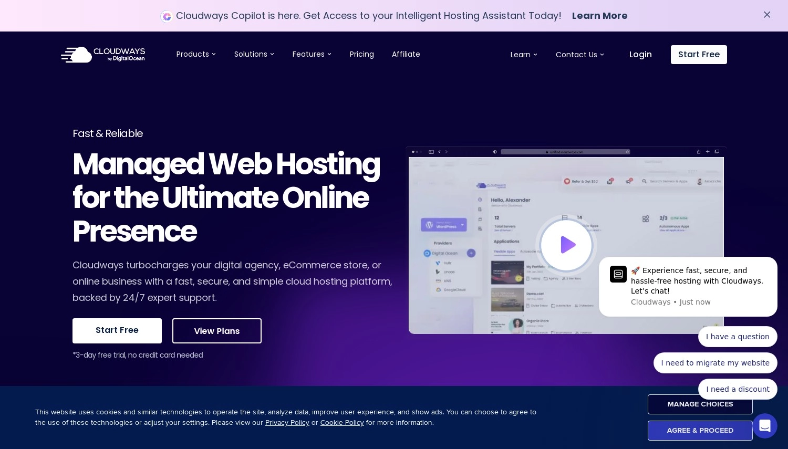
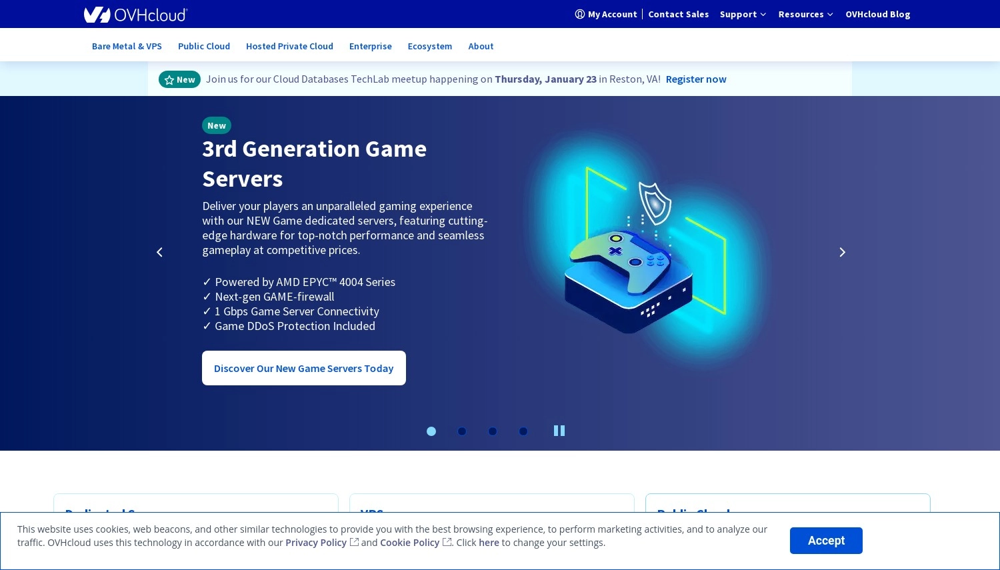
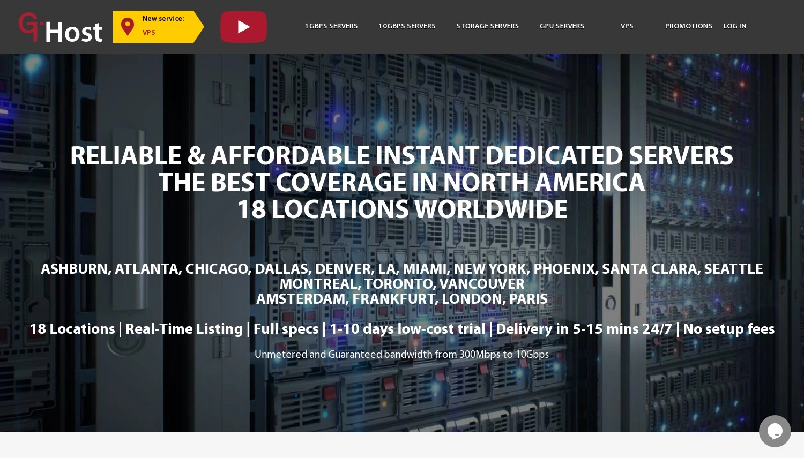

# 加拿大服务器托管完全指南：2025年9家值得关注的提供商

你在找加拿大的服务器托管方案，但又不想被一堆技术术语搞晕？我懂。市面上那么多服务商，每家都说自己最好，到底该信谁？

这篇文章会用最直白的语言，帮你搞清楚Ultahost、Kamatera、FastComet这些服务商到底怎么样。哪家速度快、哪家性价比高、哪家适合你的业务——咱们一个个说清楚。不管你是刚起步的小网站，还是流量爆棚的电商平台，这里总有一款适合你。

---

## 1. Ultahost - 高性能与免费域名的组合

评分：4.6 | 用户评价：800+ | 专用托管评分：4.6

**起步价：** $74.80/月  
**数据中心位置：** 德国、美国、加拿大、荷兰、土耳其、印度、新加坡、法国、英国、印度尼西亚

Ultahost的入门配置是**2 X 960 GB SSD和64 GB RAM**，月费$129.30。听起来不便宜？但你得看看他们提供了什么。

首先，价格透明。很多服务商前期低价吸引你，续费时突然翻倍。Ultahost直接把续费价格摆出来，让你心里有数。其次，他们的安全措施做得挺扎实——BitNinja安全防护、专用防火墙、自动备份，该有的都有。

最让人放心的是**30天退款保证**。一个月时间足够你测试服务是否符合预期。界面也很友好，不管你是技术小白还是老手，都能快速上手。

**优点：**
- 价格信息清晰，续费不玩套路
- BitNinja安全和专用防火墙保护到位
- 30天退款保证让你安心尝试
- 界面简单，新手也能轻松管理
- 24/7技术支持随时待命

**缺点：**
- 起步价格比一些竞争对手高
- 自定义配置选项多，新用户可能会感觉复杂

Ultahost的可靠性评分达到**4.9**，这意味着你的网站基本不会出现宕机问题。配合无限带宽和自动备份，👉 [想要稳定又灵活的托管方案？Ultahost值得一试](https://cp.gthost.com/en/join/72c7e6b2fc118929f9ede2978f008806)。

---

## 2. HostArmada - SSD云托管带来极速体验

评分：4.8 | 用户评价：1.1k+ | 专用托管评分：4.9

**起步价：** $81.95/月  
**数据中心位置：** 英国、加拿大、美国、德国、印度、新加坡、澳大利亚、法国、荷兰、印度尼西亚

HostArmada从$149/月起，配置相当给力——高性能处理器、大容量RAM、快速SSD存储。他们主打的是速度，用的是最新的SSD云托管技术。

**45天退款保证**比行业标准的30天更长，说明他们对自己的服务很有信心。安全方面也不含糊，高级防火墙和定期备份让你的数据不用担心。

**优点：**
- 高性能处理器和SSD存储保证速度
- 增强的安全措施，防火墙和备份到位
- 控制面板简单易用
- 24/7专属客服快速解决问题
- $149起步价配备45天退款保证

**缺点：**
- 价格对小企业或初创公司可能偏高
- 配置选项太多，新手可能眼花缭乱

HostArmada承诺**99.9%正常运行时间**，数据中心设施先进，确保你的网站随时在线。24/7专业支持团队经验丰富，能快速处理各种技术问题。

---

## 3. FastComet - 免费每日和每周备份

评分：4.7 | 用户评价：3.2k+ | 专用托管评分：4.8

**起步价：** $107.06/月  
**数据中心位置：** 美国、英国、新加坡、德国、荷兰、日本、加拿大、印度、澳大利亚、意大利

FastComet月费$139起，价格中等但配置不错。SSD存储、高端处理器、可定制的服务器配置——想要什么规格基本都能满足。

他们的控制面板设计得很人性化，技术新手和老手都能轻松驾驭。**99.9%正常运行时间保证**意味着你的业务不会因为服务器问题而中断。

**优点：**
- SSD存储和高端处理器确保速度和可靠性
- 服务器配置可定制，满足特定业务需求
- 控制面板直观，管理任务简单
- 24/7客服响应迅速
- 定价有竞争力，性价比高

**缺点：**
- 价格比一些预算型选项稍高
- 数据中心位置有限，可能影响某些地区的访问速度

FastComet的支持团队通过电话、在线聊天和邮件提供帮助，响应速度快。虽然价格不是最便宜的，但你得到的性能和支持绝对值这个价。加上退款保证，尝试他们的服务基本没有风险。

---

## 4. GreenGeeks - 环保的托管解决方案

评分：不详 | 环保托管领导者

GreenGeeks最大的特点是环保。他们向电网回馈的可再生能源是消耗量的三倍，对环保有要求的企业会很喜欢。

但环保不意味着性能打折扣。他们用LiteSpeed服务器和免费CDN（内容分发网络），确保全球用户都能快速访问你的网站。

**优点：**
- 环保托管解决方案
- 第一年免费域名和每晚备份
- 无限网站空间和数据传输
- 定价有竞争力，30天退款保证
- LiteSpeed和免费CDN带来高性能

**缺点：**
- 续费时价格会上涨
- 安装费和域名费用不可退款

安全功能也很全面：实时安全扫描、自动暴力攻击检测、垃圾邮件防护、SSL安全服务器。**30天退款保证**让你可以放心测试服务。

选择GreenGeeks，你不仅获得可靠且价格合理的托管服务，还为减少数字碳足迹做出了贡献。

---

## 5. Contabo - 全球数据中心降低延迟

评分：4.3 | 用户评价：7.1k+ | 专用托管评分：4.0

**起步价：** $103.99/月  
**数据中心位置：** 美国、德国、新加坡、英国

Contabo的低价策略很吸引人——只需$3.99就能起步。价格低但配置不缩水：大容量SSD存储、充足的RAM、大带宽。

基础套餐已经提供了相当可观的存储空间和内存，性价比确实高。Contabo对续费价格也很透明，不会让你到时候措手不及。

**优点：**
- 价格极具竞争力
- 即使入门级配置也很慷慨
- 续费价格透明，不玩套路
- 新手和专业人士都容易上手

**缺点：**
- 没有明确的退款保证可能让人犹豫
- 高级套餐的性价比不如其他提供商

设置和管理流程很顺畅，用户可以把更多精力放在项目开发上，而不是服务器管理。虽然没有明确的退款政策，但Contabo的客户满意度和竞争力价格让它成为低风险选择。

---

## 6. Kamatera - 可定制的云服务器

评分：3.8 | 用户评价：298 | 专用托管评分：4.2

**起步价：** $19.00/月  
**数据中心位置：** 美国、加拿大、荷兰、德国、英国、以色列、香港、法国、印度尼西亚、俄罗斯

Kamatera的灵活性很强——$4/月就能起步，然后根据需求定制RAM、SSD存储和带宽。基础套餐打好基础，高级套餐提供更强大的资源。

他们的服务器配备高性能CPU、大容量RAM和SSD存储，确保数据快速访问和高效处理。多层冗余设计减少宕机时间，保证业务关键操作的高可用性。

**优点：**
- 高可靠性和正常运行时间保证
- 资源灵活可扩展
- 管理仪表板直观易用
- 24/7专业客服支持
- 定价有竞争力，30天退款保证

**缺点：**
- 基础套餐可能不够大型企业使用
- 高级配置价格可能变高

Kamatera的管理仪表板简化了服务器部署、配置管理和性能监控流程，技术和非技术用户都能轻松使用。24/7客服由专业人员组成，能快速解决问题。30天退款保证让你可以无风险测试服务。

---

## 7. Cloudways - 无忧的托管云托管

评分：4.4 | 用户评价：3k+ | 专用托管评分：4.5

**起步价：** $14.00/月  
**数据中心位置：** 美国、巴西、加拿大、法国、德国、爱尔兰、英国、荷兰、瑞典、新加坡

Cloudways从$10/月起，提供完全托管的体验，让你不用操心服务器管理。入门套餐包括**1GB RAM**、**25GB存储**和**1TB带宽**，适合中小型网站。

**优点：**
- 按需付费模式，灵活性极佳
- 平台易用，新手和高手都适合
- 托管安全和自动备份提升网站安全性
- 24/7专家支持，实时聊天、电话和邮件
- 无缝扩展满足网站增长需求

**缺点：**
- 不包含邮件托管，需要外部服务管理邮件
- 一些高级配置对非技术用户可能有挑战

网站流量增长了？Cloudways可以轻松扩展资源，不会造成宕机。没有长期合同束缚，按需付费，只为你实际使用的资源付费。虽然没有明确的退款保证，但灵活的计费系统和免费试用让你可以无风险测试平台。

Cloudways使用**Apache**、**nginx**、**Varnish**和**memcached**的强大堆栈，提供高速性能。托管安全协议包括定期补丁和专用防火墙。24/7客服随时准备处理任何技术或应用层面的问题。

平台界面直观，无论是简单的应用部署、服务器监控还是资源扩展，操作都很用户友好。👉 [需要既高效又易用的云托管？试试Cloudways](https://cp.gthost.com/en/join/72c7e6b2fc118929f9ede2978f008806)。

---

## 8. OVHcloud - 强大基础设施与私有网络

评分：3.4 | 用户评价：4.2k+ | 专用托管评分：2.3

**起步价：** $7.00/月  
**数据中心位置：** 加拿大、美国、英国、荷兰、比利时、德国、法国、澳大利亚、新加坡、波兰

OVHcloud的基础套餐$50/月，包括**500GB备份空间**、至少500 Mbit/s公共带宽，支持**Windows Server**、**Debian**、**Ubuntu**和**CentOS**等主流操作系统。

**优点：**
- 服务器部署快，不到120秒完成
- 资源灵活扩展满足业务需求
- 环保节能的服务器选项
- 全面的DDoS防护
- 丰富的操作系统模板和管理界面

**缺点：**
- 退款保证信息有限
- 某些地区可能有带宽限制

OVHcloud的可扩展性很强，服务器资源可以根据业务需求调整，避免了未来昂贵复杂的升级。他们的环保承诺体现在节能的水冷服务器和专有的**反DDoS解决方案**上，确保你的数字资产安全可访问。

服务器部署速度快，**不到120秒**就能准备就绪。配合无限的入站和出站流量（亚太地区除外）和最低500 Mbit/s的公共带宽，既保证性能又保证可靠性。

---

## 9. GTHost - 即时部署和短期合约

评分：2.9 | 用户评价：28 | 专用托管评分：4.9

**起步价：** $59.00/月  
**数据中心位置：** 美国、加拿大、德国、荷兰、法国、英国

GTHost很适合预算有限的用户——低成本试用只需$5/天。没有安装费，按月付费合约灵活，满足各种预算和短期需求。

**优点：**
- 免费安装降低初始成本
- 24/7客服确保全天候支持
- 低延迟和无限带宽提升用户体验
- 内部维护提供更快、更经济的解决方案
- 服务器配置可定制，灵活性高

**缺点：**
- 缺少退款保证信息
- 续费价格细节不明确，可能影响长期预算规划

GTHost的特点是速度快——付款后五到十五分钟内就能配置好服务器。配合免费安装、24/7客服、低延迟、无限带宽、高效的内部维护和可定制服务器选项，GTHost性价比很高。

虽然退款保证和续费定价信息暂时不详，但他们的客户导向方法和低门槛试用让你可以以最小的财务承诺测试服务。快速设置和强大的定制选项为他们的专用服务提供了坚实基础。

---

## 如何为你的加拿大业务选择合适的托管商

选托管服务商就像找对象，得看是否合适。你是个人博客、电商网站还是企业站？需求不同，选择就不同。

核心要素包括：高性能、安全性和专业支持。比如A2 Hosting承诺速度比普通托管快20倍，**99.9%正常运行时间**，还有**100%无忧退款保证**。对加拿大网站来说，选择离你用户近的数据中心能大幅降低延迟，提升加载速度和用户体验。

支持水平也很关键。A2 Hosting提供**24/7/365 Guru Crew支持团队**，随时帮你解决问题，包括迁移和软件安装，确保网站平稳运行。

选择支持即时账户激活、免费迁移，并能轻松设置WordPress、Magento、Joomla等主流CMS平台的服务商，能显著减少技术挑战。如果你的网站流量大或应用复杂，加拿大的专用服务器可能更合适——提供更多动力、灵活性和定制化，满足特定需求。

---

## 总结：2025年加拿大专用服务器的最佳选择

找到2025年加拿大的优质专用服务器托管现在容易多了。不管你运营的是大型电商平台、数据库密集型应用还是热闹的在线社区，选对托管方案至关重要。

文中介绍的Ultahost、Kamatera、FastComet、HostPapa和Liquid Web各有特色。Ultahost以定制配置和托管服务器领先，适合重视灵活性和安全性的用户。Kamatera凭借可定制的高性能服务器令人惊艳，服务需要高效增长的企业。FastComet提供优质功能和可靠基础设施，适合追求稳定安全托管的加拿大企业。HostPapa为各种规模的企业提供可扩展套餐，正常运行时间和支持都很出色。

最后，Liquid Web提供一系列高性能解决方案，适合要求苛刻的应用和高流量网站，配备卓越的支持。这些提供商代表了2025年加拿大专用托管服务的顶峰，以其性能、可靠性和用户友好功能而著称。如果你还在纠结选哪家，不妨先从免费试用或退款保证入手——毕竟，适合自己的才是最好的。
